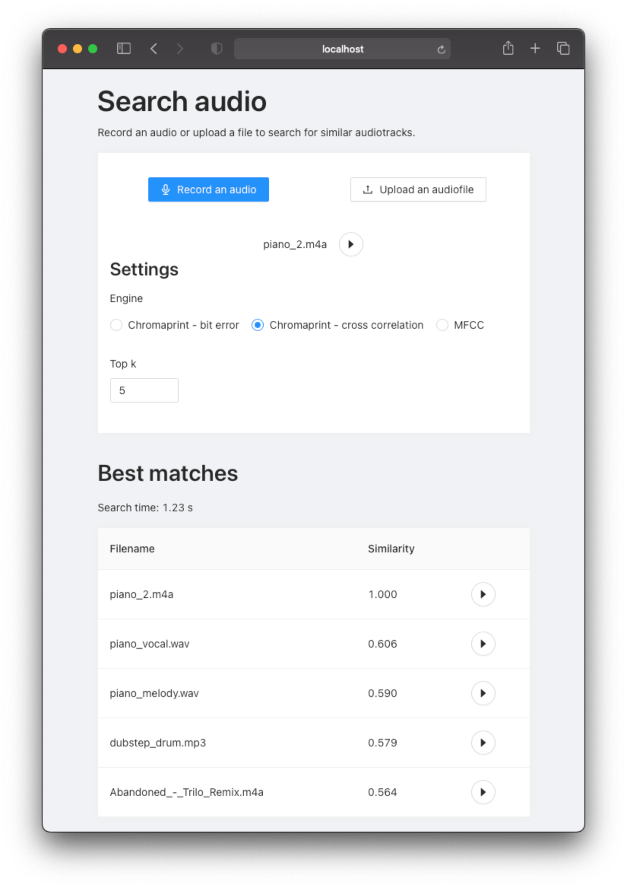

# Audio similarity

This project is a semestral work for course NI-VMM on FIT CTU. It is a Shazam-like app that returns a set of similar audio tracks for an audio query.

## Project structure

 - [server](server) - web server
   - [core](server/core) - core module with different engine types - MFCC, Chromaprint with bit error similarity, Chromaprint with cross correlation similarity
   - [app.py](server/app.py) - Flask server wrapper exposing `/search` and `/audiotracks/{filename}` endpoints.
   - [db.py](server/db.py) - database construction script.
   - [get_engine.py](server/db.py) - function to initialize correct engine type. It has `-e` parameter to set an engine type (`mfcc`, `chromaprint` or `chromaprint_cc`) and `-c` parameter which will erase the database before constructing it.
 - [client](client) - client web React app
 - [Jupyter notebook](audio_similarity_prototype.ipynb) with prototypes

## Running locally

The project consists of a python Flask server, MongoDB database and React web client. Everything runs in Docker containers, so **Docker needs to be installed** on the target system.

1. Add `.env` file with all required environment variables into the root of project. Sample can be found in `.env.example`
2. Run `make run` which will build and start all docker containers
3. Run `make db` to construct the reference database. It will take all audio files from `data` folder, so make sure there are any.
4. (optional) If you want to also use `MFCCEngine`, run `make db_mfcc`. Note it will last much longer than `make db`.

This will start the client web app on address `localhost:3000` and the server on `localhost:5000`. You can record an audio or upload an audiofile in the client web app to search for similar tracks in the reference dataset.

Other useful commands can be found in the [Makefile](Makefile).

## Example

